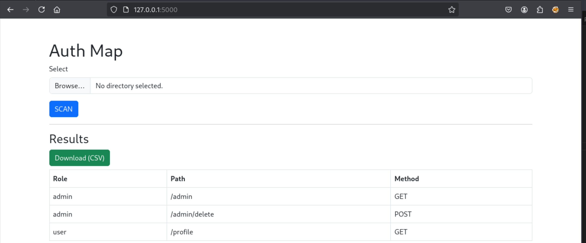
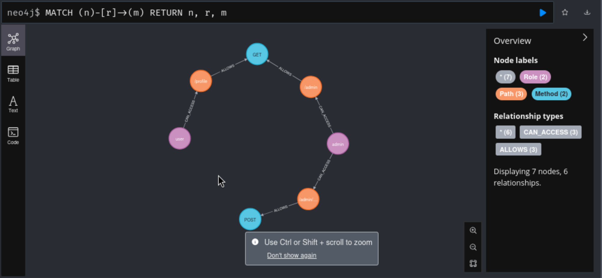

# AuthGraph

**AuthGraph** is a Flask-based tool that analyzes role-based access control (RBAC) logic in source code. It scans Express.js route definitions to extract access relationships, generates a CSV output, and pushes relationship data to a Neo4j graph database.

---

## 🚀 Features

- 📂 Upload source folders via web interface
- 🔍 Extract route-role-method relationships from Express.js code
- 📄 Export results as CSV
- 🌐 Visualize relationships in Neo4j (Role → Path → Method)
- 🌟 (Coming soon) Interactive graph frontend with vis.js

---

## 🧰 Setup Instructions

### 1. Create a virtual environment
```bash
python -m venv venv
source venv/bin/activate
pip install -r requirements.txt
```

### 2. Start Neo4j with Docker
```bash
docker-compose up -d
```
> Access Neo4j Browser at [http://localhost:7474](http://localhost:7474)  
> Username: `neo4j` • Password: `test1234`

### 3. Launch the Flask App
```bash
PYTHONPATH=$(pwd) python web/app.py
```

---

## 🌐 Usage

1. Open the web UI at: `http://127.0.0.1:5000`
2. Upload a folder containing JS code → Start Scan → View roles and routes in table format
3. Download the CSV output
4. Data is automatically visualized in Neo4j

---

## 📷 Screenshots

### 🖼️ Flask Web Interface




### 🕸️ Neo4j Relationship Graph





---

## 📁 Project Structure

```
authgraph/
├── authgraph/                # Python package with core logic
├── web/                      # Flask app with templates and static files
├── examples/                 # Sample Express.js app
├── tests/                    # Unit tests
├── requirements.txt
├── docker-compose.yml
├── main.py
└── README.md
```

---
